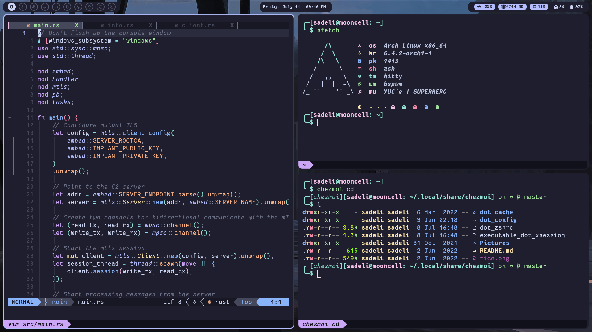

# dots

My dotfiles, rices, neovim configs, polybar configs, etc. Basically my archive. Dots are managed by chezmoi.

*screenshot*\
Wallpaper by Okeno Kamoku: https://www.pixiv.net/en/artworks/84073381

- **bar**: [polybar](https://github.com/polybar/polybar)
- **launcher**: [rofi](https://github.com/adi1090x/rofi)
- **compositor**: [picom-ibhagwan-git](https://github.com/ibhagwan/picom)
- **discord theme**:[discocss](https://github.com/mlvzk/discocss)
- **spotify theme**: [spicetify](https://github.com/khanhas/spicetify-cli)
